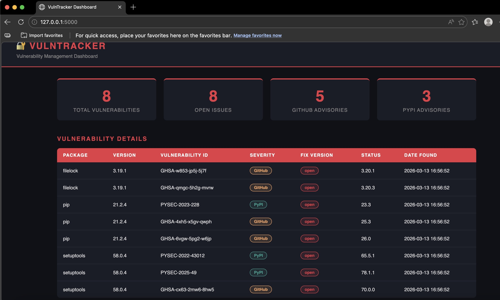
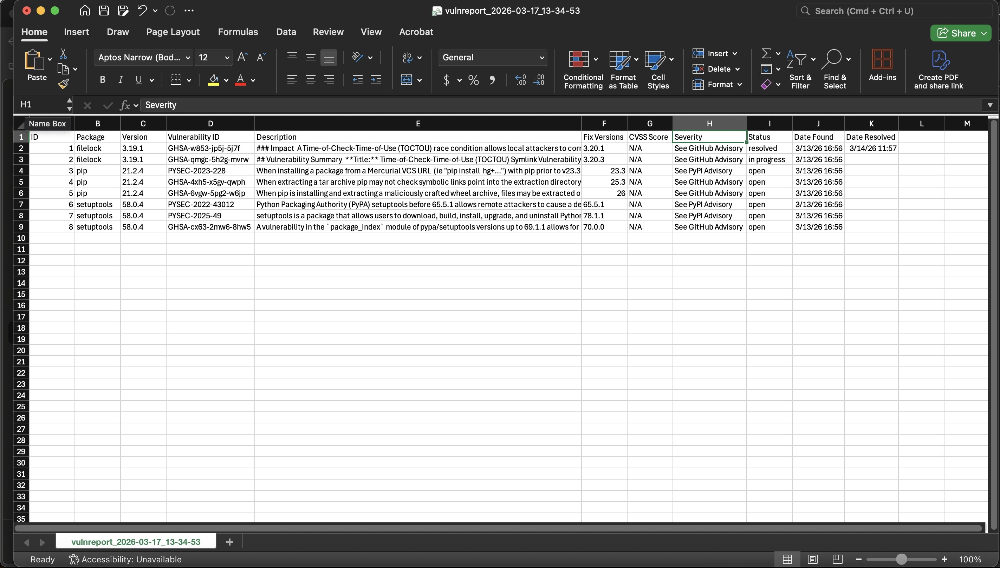

# VulnTracker 🔐
A Python-based vulnerability management tool that scans environments for known security vulnerabilities, enriches findings with NVD API data, and tracks remediation through a web dashboard.

## Screenshots

## Features
- Automated vulnerability scanning using pip-audit
- NVD API integration for CVE enrichment and CVSS scoring
- SQLite database for persistent vulnerability tracking
- Web dashboard with real-time vulnerability visualization
- Remediation workflow tracking (Open, In Progress, Resolved)
- CSV report export for management reporting

## Tech Stack
- Python 3
- Flask
- SQLite
- pip-audit
- NVD API (NIST National Vulnerability Database)

## Setup
Clone the repository and navigate into it, then create and activate a virtual environment, install dependencies from requirements.txt, and set your NVD API key as an environment variable. Get a free key at https://nvd.nist.gov/developers/request-an-api-key

## Usage
Set your PYTHONPATH to the project root, then run the scanner with python3 scanner/pip_scanner.py and launch the dashboard with python3 dashboard/app.py. Open your browser at http://127.0.0.1:5000

## Dashboard
The web dashboard provides:
- Summary cards showing total vulnerabilities and open issues
- Color coded severity badges for GitHub and PyPI advisories
- Fix version recommendations for each vulnerability
- One click remediation status updates
- CSV export for management reporting

## Author
ShayVon Ballard
- GitHub: https://github.com/shayvon-ballard